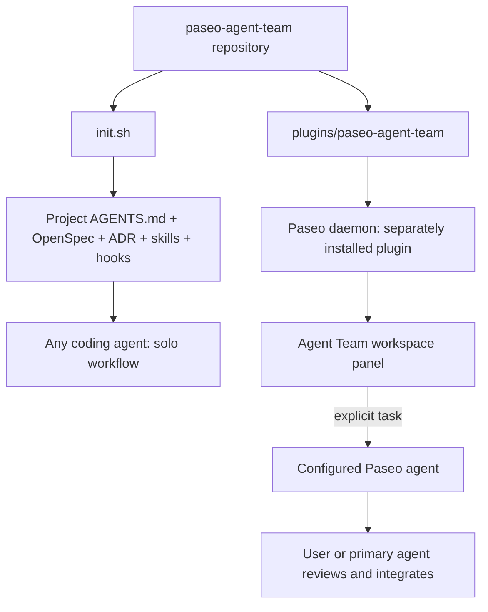
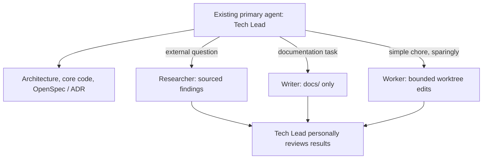
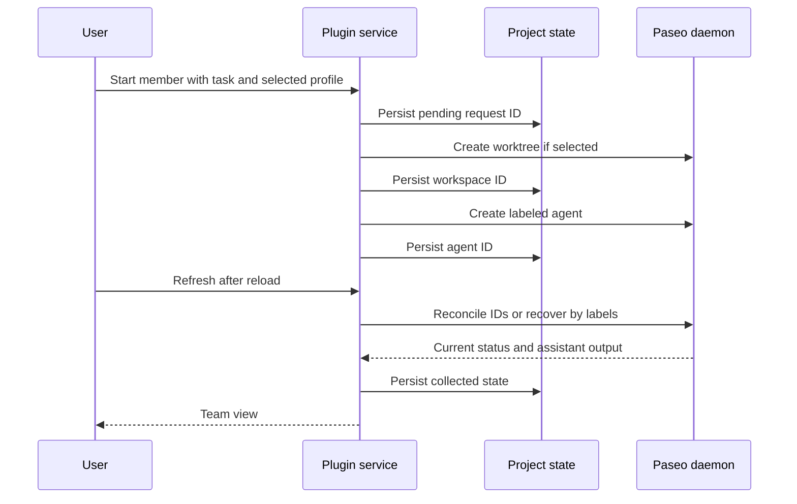

# Architecture

Paseo Agent Team has two independently usable distributions: a shell installer for engineering discipline and a native Paseo plugin for requested collaboration. This page explains the boundaries for maintainers; [Getting Started](./getting-started.md) covers installation.

## Two execution modes



The standalone installer never copies the plugin, installs npm dependencies, or starts a helper. The plugin never implicitly installs the engineering workflow or starts agents on load. [ADR-0001](../adr/0001-independent-workflow-and-paseo-plugin.md) records these distribution boundaries.

## Role ownership



The plugin never spawns a Tech Lead. Researcher and Writer isolate bulky context, and Worker returns complex work to the lead. Creation accepts only these three helper roles. See [Team roles](./team-roles.md) for responsibilities and configuration guidance.

## Plugin boundaries

```text
plugins/paseo-agent-team/
  paseo-plugin.json       ID, Paseo 0.8.x compatibility
  index.client.tsx        Workspace panel, Command Center, slash command
  index.server.ts         Typed domain RPC registration
  client/team-panel.tsx  Native controls and request state
  shared/team.ts         Zod contracts, creation and persisted role schemas
  shared/roles.ts        Helper scopes and configuration guidance
  server/paseo-runtime.ts  Adapter to the installed Paseo SDK
  server/team-service.ts   Idempotent member lifecycle and ownership checks
  server/storage.ts        Atomic state, ignore entry, OpenSpec progress reads
```

Client code uses host React Native primitives, theme colors, and compact layout. It never imports Node or server modules. Server handlers combine project-specific state and SDK operations. Profiles are read selectively from the daemon configuration; credentials and unrelated configuration never cross the plugin RPC boundary.

Paseo owns provider processes, conversations, permissions, and workspaces. The plugin owns role/task associations and the team's interface. Members are label-grouped agents; assigning a parent conversation or automatic task dependencies is not implemented in this version.

## State and failure handling



The `.paseo-agent-team/` runtime directory is created on demand and ignored by Git. Writes validate the versioned schema and replace the state file atomically. Operations serialize by canonical originating directory within the plugin process. Reusing a request ID never creates another member; uncertain launches stay unresolved until reconciled. Lifecycle events are not treated as durable task completion records.

Worker requires a separate worktree. Writer writes only `docs/`; Researcher writes only requested reports under `.paseo-agent-team/handoff/`. Scopes are instructions subject to the chosen provider's actual permissions. Archival targets a recorded member and preserves its worktree and collected result. There are no automatic merges, cascading workspace deletions, or permission approvals.

A plugin reload loses in-memory locks but preserves the state file. Concurrent plugin installations or multiple hosts writing the same state are unsupported. The panel refreshes explicitly rather than polling; live conversations are available through Paseo navigation.

## Workflow installation

The installer supports `openspec,adr,skills,hooks`. Source detection checks workflow files, independent of the plugin. Selected managed schemas and skills refresh idempotently; `openspec init` reruns to repair partial generation. General skills remain at root `skills.txt` plus schema manifests.

Root instructions use `paseo-agent-team` marker blocks; user content stays outside the block. Malformed markers fail before replacement. The installer recognizes its managed hook to avoid recursive chaining. The current-run manifest is `.paseo-agent-team.yaml`.

The pre-commit shim invokes versioned hook logic and preserved user hooks. The logic validates OpenSpec and rejects mutation of accepted numbered ADRs. `PASEO_AGENT_TEAM_SKIP_HOOKS=1` is the explicit maintenance bypass.

## Persistent sources of truth

`openspec/specs/` describes supported current capabilities. `adr/` records accepted architectural decisions. Team state is operational context and does not replace either. Update current specs with behavior changes and supersede accepted decisions through new ADRs.

| Decision | Scope |
|-------------------|-------|
| [ADR-0001](../adr/0001-independent-workflow-and-paseo-plugin.md) | Independent workflow and native plugin distributions |
| [ADR-0002](../adr/0002-spec-driven-change-management.md) | OpenSpec pipeline, immutable ADRs, and discipline hooks |
| [ADR-0003](../adr/0003-merge-based-workflow-installation.md) | Managed installation, recovery, and upgrade compatibility |
| [ADR-0004](../adr/0004-explicit-team-ownership.md) | Tech Lead ownership and explicitly requested helper roles |
| [ADR-0005](../adr/0005-recoverable-project-local-team-state.md) | Team persistence, reconciliation, and safe member operations |

## Verification

Installer regressions cover default/subset installation, managed upgrades, malformed markers, hook chaining, existing OpenSpec context, and partial initialization. Plugin tests cover no-action startup, duplicate starts, state reconciliation, worktree isolation, ownership, archived results, and state-file protection. Typechecking targets the declared 0.8.0 SDK. See [CONTRIBUTING.md](../CONTRIBUTING.md) for the commands and runtime checks required before review.
