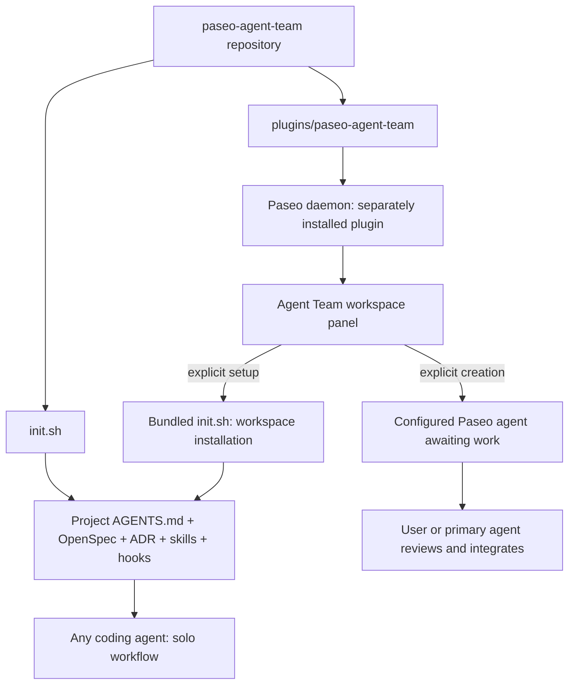
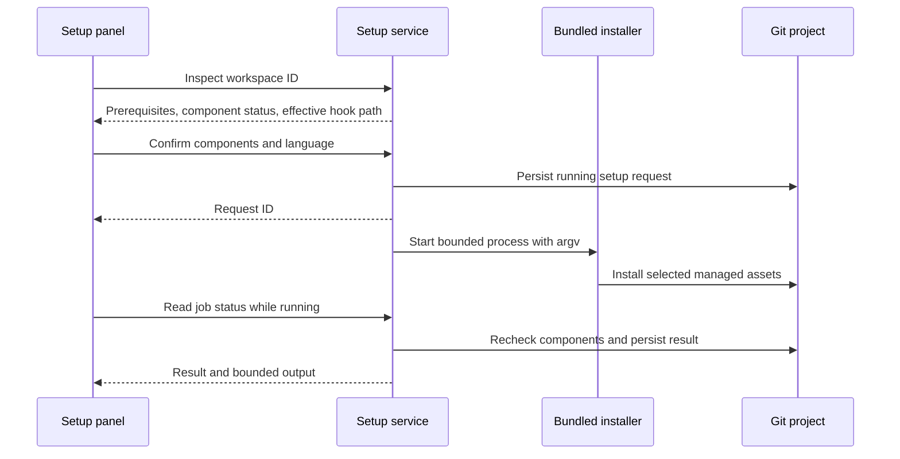
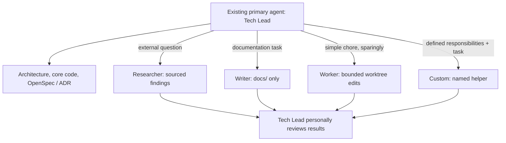
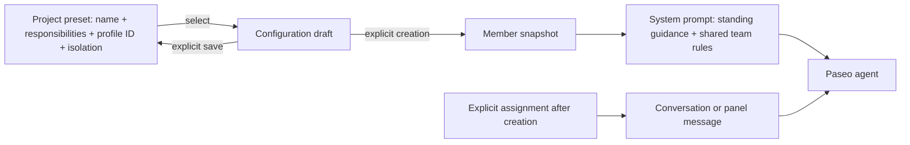
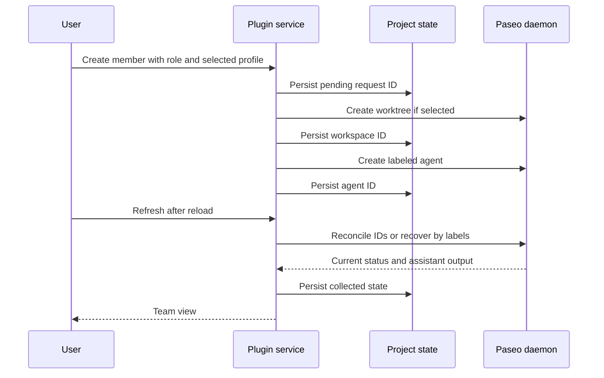

# Architecture

Paseo Agent Team has two independently usable distributions: a shell installer for engineering discipline and a native Paseo plugin for explicit project setup and requested collaboration. This page explains the boundaries for maintainers; [Getting Started](./getting-started.md) covers installation.

## Two execution modes



The standalone installer never copies the plugin, installs npm dependencies, or starts a helper. The plugin never implicitly installs the engineering workflow or starts agents on load. [ADR-0001](../adr/0001-independent-workflow-and-paseo-plugin.md) records these distribution boundaries.

## Explicit project setup



Plugin preparation packages the root installer, declared skills, schemas, rule files, and licenses into an ignored server-only JSON snapshot. `npm ci`, typechecking, tests, and Paseo installation regenerate it. Runtime setup uses that snapshot, not a downloaded installer or a second TypeScript installation implementation. The complete source checkout is required during preparation.

Setup RPCs resolve the destination from the selected workspace ID. They reject nested Git targets, missing required tools, invalid selections, and symlinked managed destinations before starting. Jobs serialize per canonical root within the plugin process, reuse the last request ID, and run outside the RPC lifetime. Process groups support cancellation and a two-minute timeout. The last 20,000 output characters and result are persisted in `.paseo-agent-team/setup.json`; abandoned running records become interrupted on read. Component checks and the current-run manifest distinguish success from partial installation.

Cancellation waits for process-group termination even if the installer exits before its children. When the panel recovers a request after a lost response, observing the matching job clears its pending request identity so a later explicit repair starts a fresh job.

Only active setup jobs are polled. Opening setup is read-only and never launches an agent. A copyable onboarding prompt keeps project specs, architecture, and ADRs with the existing primary agent. [ADR-0006](../adr/0006-explicit-panel-workflow-installation.md) records this entry point.

## Role ownership



The plugin never spawns a Tech Lead. Researcher and Writer isolate bulky context, and Worker returns complex work to the lead. Custom members add a user-defined name and optional standing responsibilities under the same lead ownership. See [Team roles](./team-roles.md) for responsibilities and configuration guidance.

## Standing roles and project presets



Presets live separately in version 1 `.paseo-agent-team/templates.json`, with a maximum of 100 entries. List operations do not create files. Save/delete share canonical-project serialization with member mutations and use schema validation, symlink checks, and atomic replacement. Retrying a save with the same UUID upserts that template; concurrent edits of the same template use the last explicit save. Presets store profile/model references, not provider settings or credentials. An unavailable choice must be reselected.

Member records use the same current role set as creation: Researcher, Writer, Worker, and Custom. Each member stores its role configuration, agent/workspace associations, status, and collected output. Custom members snapshot their name and optional responsibilities; presets have no live link to members. Creation omits Paseo's initial `prompt`, and explicit conversation messages supply work. Both creation and member storage validate the current schema. [ADR-0009](../adr/0009-current-development-member-model.md) records this model.

## Plugin boundaries

```text
plugins/paseo-agent-team/
  paseo-plugin.json       ID, Paseo 0.8.x compatibility
  index.client.tsx        Workspace panel, Command Center, slash command
  index.server.ts         Typed domain RPC registration
  client/team-panel.tsx    Team/Project tabs, member cards, follow-up and archive
  client/member-composer.tsx  On-demand role configuration form and searchable profile picker
  client/setup-panel.tsx   Project summary, configure/review steps, logs, onboarding
  client/ui.tsx            Shared theme-aware controls and disclosures
  shared/team.ts         Zod contracts, creation and persisted role schemas
  shared/setup.ts        Setup inspection and job contracts
  shared/templates.ts    Template configuration and CRUD contracts
  scripts/bundle-workflow.mjs  Generate the server-only workflow snapshot
  shared/roles.ts        Helper scopes and configuration guidance
  server/paseo-runtime.ts  Adapter to the installed Paseo SDK
  server/team-service.ts   Idempotent member lifecycle and ownership checks
  server/template-service.ts  Project-local template storage and CRUD
  server/storage.ts        Atomic state, ignore entry, OpenSpec progress reads
  server/setup-service.ts  Component checks, installation jobs, result persistence
  server/setup-process.ts  Bounded processes and process-group cancellation
  server/workflow-assets.json  Generated, ignored workflow snapshot
```

Client code uses host React Native primitives, icons, and theme colors. Layout follows both the host's compact hint and the measured panel width, so Explorer sidebars stack controls too. The Team tab contains everyday member actions; Project contains setup and OpenSpec progress. Setup stays mounted across tab switches to observe a running installation; the member form retains its draft and retry identity while closed. Profiles load when the form is first opened. Client code never imports Node or server modules. Server handlers combine project-specific state and SDK operations. Profiles are read selectively from the daemon configuration; credentials and unrelated configuration never cross the plugin RPC boundary.

Paseo owns provider processes, conversations, permissions, and workspaces. The plugin owns member configuration and associations and the team's interface. Members are label-grouped agents; assigning a parent conversation or automatic task dependencies is not implemented in this version.

## State and failure handling



The `.paseo-agent-team/` runtime directory is created on demand and ignored by Git. Writes validate the versioned schema and replace the state file atomically. Operations serialize by canonical originating directory within the plugin process. Reusing a request ID never creates another member; uncertain launches stay unresolved until reconciled. Lifecycle events are not treated as durable task completion records.

Worker requires a separate worktree. Writer writes only `docs/`; Researcher writes only requested reports under `.paseo-agent-team/handoff/`. Scopes are instructions subject to the chosen provider's actual permissions. Archival targets a recorded member and preserves its worktree and collected result. There are no automatic merges, cascading workspace deletions, or permission approvals.

A plugin reload loses in-memory locks but preserves the state file. Concurrent plugin installations or multiple hosts writing the same state are unsupported. The panel refreshes explicitly rather than polling; live conversations are available through Paseo navigation.

## Workflow installation

The installer supports `openspec,adr,skills,hooks`. Source detection checks workflow files, independent of the plugin. Selected managed schemas and skills refresh idempotently; `openspec init` reruns to repair partial generation. General skills remain at root `skills.txt` plus schema manifests.

Root instructions use `paseo-agent-team` marker blocks; user content stays outside the block. Malformed markers fail before replacement. The installer recognizes its managed hook to avoid recursive chaining. The current-run manifest is `.paseo-agent-team.yaml`, and `PASEO_AGENT_TEAM_REPO` selects the remote source. Installer code and panel inspection use these current identifiers as recorded in [ADR-0010](../adr/0010-current-development-workflow.md).

The pre-commit shim invokes versioned hook logic and preserved user hooks. Git resolves the effective hook path for linked worktrees and custom `core.hooksPath`; the shim uses the committing worktree’s discipline script and tolerates an uninitialized sibling checkout. The logic validates OpenSpec and rejects mutation of accepted numbered ADRs. `PASEO_AGENT_TEAM_SKIP_HOOKS=1` is the explicit maintenance bypass.

## Persistent sources of truth

`openspec/specs/` describes supported current capabilities. `adr/` records accepted architectural decisions. Team state is operational context and does not replace either. Update current specs with behavior changes and supersede accepted decisions through new ADRs.

| Decision | Scope |
|-------------------|-------|
| [ADR-0001](../adr/0001-independent-workflow-and-paseo-plugin.md) | Independent workflow and native plugin distributions |
| [ADR-0002](../adr/0002-spec-driven-change-management.md) | Original workflow discipline; superseded by ADR-0010 |
| [ADR-0003](../adr/0003-merge-based-workflow-installation.md) | Original managed installation; superseded by ADR-0010 |
| [ADR-0004](../adr/0004-explicit-team-ownership.md) | Original helper role set; superseded by ADR-0007 |
| [ADR-0005](../adr/0005-recoverable-project-local-team-state.md) | Team persistence, reconciliation, and safe member operations |
| [ADR-0006](../adr/0006-explicit-panel-workflow-installation.md) | Explicit setup through the bundled standalone installer |
| [ADR-0007](../adr/0007-custom-helper-configurations.md) | Custom role configurations; superseded by ADR-0008 |
| [ADR-0008](../adr/0008-standing-role-members.md) | Standing-role members; superseded by ADR-0009 |
| [ADR-0009](../adr/0009-current-development-member-model.md) | Current member contract and explicit compatibility requirements |
| [ADR-0010](../adr/0010-current-development-workflow.md) | Current workflow identifiers, managed installation, and engineering discipline |

## Verification

Installer regressions cover default/subset installation, managed upgrades, malformed markers, hook chaining, existing OpenSpec context, and partial initialization. Plugin tests cover no-action startup, duplicate starts, state reconciliation, worktree isolation, ownership, archived results, and state-file protection. Setup tests cover partial detection, installation and repair, missing tools, unsafe targets, concurrency, cancellation, timeouts, and interrupted records. Hook regressions cover linked worktrees and custom paths. Typechecking targets the declared 0.8.0 SDK. See [CONTRIBUTING.md](../CONTRIBUTING.md) for the commands and runtime checks required before review.
