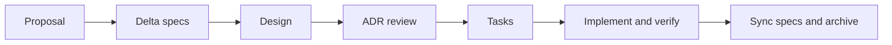

# Engineering workflow

Use OpenSpec to define significant changes and ADRs to preserve architectural reasoning. Any coding agent can follow this workflow without Paseo; your primary agent owns the implementation and project decisions.

## Choose the scope

| Change | Process |
|--------|---------|
| New capability, public interface or data model, dependency, or structural change | Full `spec-driven-with-adr` workflow |
| Small bug fix, local refactor, or documentation maintenance | Direct implementation and relevant verification |
| Exploratory spike | `minimalist` schema or a bounded experiment; complete the full design and ADR work before production adoption |

Read `openspec/specs/` and the effective decisions in `adr/` before designing a change. Review [AGENTS.md](../AGENTS.md) for ownership and collaboration rules.

## Create the five artifacts



```bash
openspec new change <change-name>
openspec status --change <change-name>
```

The configured default is `spec-driven-with-adr`.

| Artifact | Location under `openspec/changes/<change-name>/` | Purpose |
|----------|-------------------------------------------------|---------|
| Proposal | `proposal.md` | Problem, scope, capability changes, and non-goals |
| Specs | `specs/<capability>/spec.md` | Requirements and observable scenarios |
| Design | `design.md` | Technical approach based on current specs and ADRs |
| ADR | `adr.md` | Decision review and references to new durable records in root `adr/` |
| Tasks | `tasks.md` | Implementation steps and acceptance checks |

Use the installed OpenSpec skills to create and advance artifacts, apply tasks, verify behavior, and archive completed work. The [Git discipline skill](../.agents/skills/openspec-git-discipline/SKILL.md) defines commit checkpoints: proposal artifacts reach `main` before implementation depends on them, and implementation reaches `main` before archive. Agents create commits and merges only when requested.

## Implement, verify, and archive

Complete the tasks and verify the stated scenarios. Update affected documentation in the same change; keep setup instructions and both README languages aligned with shipped behavior.

```bash
openspec validate --all --strict
openspec archive <change-name>
```

Archive synchronizes delta specs into `openspec/specs/` and moves completed artifacts to `openspec/changes/archive/`. Check the resulting specs and archive changes before committing them. General development checks are in [CONTRIBUTING.md](../CONTRIBUTING.md).

## Explore with the minimalist schema

```bash
openspec new change <spike-name> --schema minimalist
```

This schema creates specs and tasks. A validated prototype still needs the full design and ADR process before it becomes a production implementation.

## Maintain architectural decisions

Number ADRs as `adr/NNNN-kebab-title.md`. Each record includes status, date, context, decision, and consequences. See the [ADR rules](../adr/README.md) for the format.

Accepted ADRs are immutable. To replace a decision, add a new numbered record with status `accepted, supersedes ADR-NNNN` and a `Supersedes:` field; leave the old record unchanged. Derive effective decisions from those relationships.

The primary agent owns all `openspec/` and `adr/` edits. Update the [architecture overview](./architecture.md) when structural changes land. Helpers return bounded deliverables for the primary agent to review.

## Local commit checks

The installed `.git/hooks/pre-commit` shim chains existing user hooks and invokes versioned `scripts/pre-commit.sh`. It rejects edits to tracked numbered ADRs and runs `openspec validate --all --strict`. If the CLI is unavailable, it prints a notice and skips specification validation.

For explicitly authorized maintenance, `PASEO_AGENT_TEAM_SKIP_HOOKS=1` skips the managed discipline checks. Ordinary commits run the checks.
