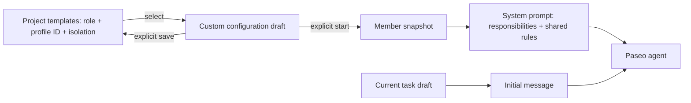

## Context

Creation currently accepts three fixed roles, while persisted records also accept two legacy roles. Role instructions and the task are concatenated into a system prompt even though Paseo also receives the same task as its first message. The user requests Custom members and reusable templates, and questions the overlap in responsibilities and tasks.

ADRs 0001–0006 are accepted with no existing supersession edges. ADR-0004's closed role set must be superseded; distribution, lead ownership, persistence, and explicit installation decisions remain applicable.

## Goals / Non-Goals

**Goals:** Custom identity and optional standing guidance; project-local configuration templates; unambiguous role/task separation; recoverable creation and compatibility with all existing records.

**Non-Goals:** Cross-project/global template synchronization, automatic launch, editing live agents' system prompts, changing provider permissions, or a new lead role.

## Decisions

| Data | Location | Limits / behavior |
|------|----------|-------------------|
| Custom definition | `customRole: { name, instructions? }` on `role: custom` | Trimmed name 1–80 characters; optional instructions up to 8,000 |
| Member | Existing version 1 `state.json` | Snapshot custom definition; no live template dependency |
| Template | Version 1 `templates.json` | Up to 100 templates; UUID, definition, choice ID, isolation, update time; no task or credentials |
| Task | Member record and initial user message | Existing nonblank 16,000-character limit; never in the system prompt |

Keep `roles` as the built-in preset map and add a separate Custom enum case. Refine launch and member validation so custom definitions belong only to Custom members and are required for that role. Extend the display helper to resolve custom names; legacy labels remain unchanged.

Store templates separately so invalid template state does not block viewing or operating existing members. Use shared canonical-directory locking for team and template mutations, including ignore-file updates. Reuse symlink guards and atomic writes. Client-generated stable template UUIDs make retrying a save an upsert. The selected profile ID is a reference; resolve available profiles at launch and visibly reject unavailable selections rather than retaining provider credentials or substituting defaults.

The role picker gains Custom. Its name is required and standing responsibilities are optional. A project-template disclosure provides list/select/update/delete actions; template saving requires a name and available profile but no task. Selection copies fields and leaves the task unchanged. Save-as-new uses a fresh ID; update uses the selected ID. Launch copies the draft into the member, preserving its identity if templates change later. Deletion has an explicit confirmation control. Built-in instructions remain accessible as preset guidance; shared permissions/ownership explanation is separate.

Keep preset behavioral instructions; remove the task from `memberPrompt` and leave it only in the runtime's `prompt` field. This also avoids making a completed first task a permanent system instruction during follow-ups.

Alternatives rejected: free-form role enum strings (break fixed-role semantics and legacy identity); required responsibilities (forces duplicate task input); templates embedded in member state (couples unrelated recovery paths); global storage (adds host-wide scope without a request); embedding task in templates (replays stale assignments).

## Risks / Trade-offs

- Custom guidance can be vague or conflict with project rules → shared team rules and lead ownership remain in every system prompt; actual permissions stay with the provider.
- A saved profile may disappear → show the missing ID and require reselection; never silently switch configurations.
- Older plugin versions do not understand custom records → additive reader compatibility applies forward; preserve new state before any downgrade rather than relabel members.
- Simultaneous clients can update the same template → serialized atomic upserts, last explicit save wins; no collaborative editing protocol.
- Template updates do not change existing agents → member details show the saved launch responsibilities; UI explains that templates affect future launches.

## Migration Plan

No existing member migration. Missing template files read as an empty list without writes. Reload the validated plugin; old presets and legacy records continue to work. Verify custom launch/restore and template CRUD in isolated tests, and exercise the compiled panel with real template RPCs on a temporary project. Avoid launching real helpers merely for UI verification.

## Open Questions

ADR-0004 is superseded by ADR-0007 for the expanded role model; its ownership rules are retained. The user explicitly selected template reuse; project-local scope follows existing team storage and is documented in the UI.
