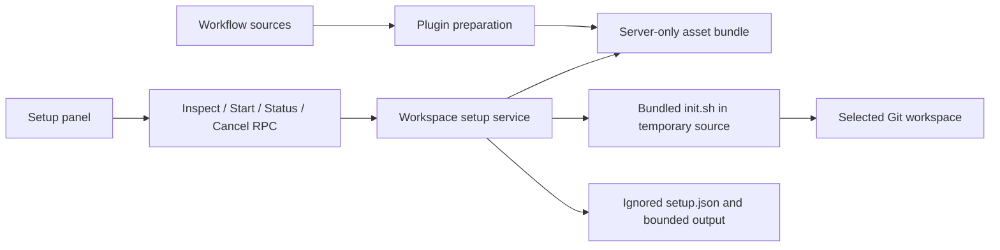

## Context

The native panel currently offers team controls and a boolean OpenSpec check. The installer already owns managed asset upgrades. ADR-0001 and ADR-0003 require independent distributions and preservation of user content; an explicit panel entry point is compatible with these decisions. Paseo 0.8 plugin RPCs time out after 30 seconds and do not expose a source directory to handlers.

## Goals / Non-Goals

**Goals:** make project setup available in the panel, report accurate per-component readiness, reuse the standalone installer, support worktrees, and expose useful installation outcomes on desktop and compact clients.

**Non-Goals:** automatically install global packages, initialize Git, create agents for onboarding, operate OpenSpec changes through buttons, change provider settings, or automatically commit/merge/push.

## Decisions

1. Generate an ignored JSON asset bundle during npm preparation, typecheck/test preparation, and Paseo install preparation. Include only the standalone installer, instruction template, schemas, ADR rules, discipline script, and manifest-declared skills. This avoids duplicating installer logic or relying on an unavailable runtime plugin-directory API. Missing source assets fail preparation.
2. Introduce a dedicated setup service and typed RPCs. Resolve target directories through the existing runtime adapter; accept no client-supplied shell command or filesystem target. Inspect prerequisites using bounded processes and verify managed destinations before starting. Component inspection checks expected files, managed instructions, and effective hooks rather than only a manifest.
3. Start a bounded background job after preflight. Persist the last job under `.paseo-agent-team/setup.json` before launching. Keep current bounded output in memory, persist final output atomically, and report a running record without a live process as interrupted. Serialize starts per canonical root, reuse the last request ID, and reject a different start while running. Cancel and shutdown terminate the process group. Poll only the active setup job, stopping on a terminal state.
4. Reuse the source installer in a fresh temporary directory, with argv options for selected components and language. Recheck selected components after completion, distinguishing partial installation from success. Updates use the installed plugin bundle revision, never an implicit network update. Git hooks use Git's effective path, which can be shared by worktrees or customized through `core.hooksPath`; show that path in setup details.
5. Split native setup controls into their own component. Show current directory, component and prerequisite status, an explicit plan, initialization/repair action, cancel, bounded logs, and a copyable primary-agent onboarding prompt. Existing team controls and manual team refresh remain.

## Risks / Trade-offs

- [Installation is not transactional] → make partial outcomes explicit; preserve completed assets and repair through an explicit rerun. Cancellation is not rollback.
- [Shared hooks affect sibling worktrees] → display the effective hook path and make the shim skip missing discipline scripts in uninitialized siblings while still chaining existing hooks.
- [Plugin reload interrupts a job] → terminate subprocesses on cleanup, persist terminal results where possible, and treat leftover running records as interrupted.
- [Generated assets can become stale] → regenerate on prepare, typecheck, tests, and installation; include revision and content digest in inspection.
- [Runtime inspection cannot prove semantic correctness of project specs] → label component checks as installation readiness, and leave project analysis and architectural judgment to the primary agent.
- [Multiple plugin processes writing one project] → retain the existing one-plugin-per-project operational constraint; in-process locks protect multiple clients.

## Migration Plan

Regenerate the bundle, run installer regressions and plugin tests/typecheck, reload the installed plugin, and verify the new RPCs and panel. Existing team state remains version 1 and untouched by setup inspection. Removing the new setup controls leaves initialized projects usable with the standalone workflow.

## Open Questions

None. The user authorized skipping Git lifecycle checkpoints for this change without committing or pushing. ADR format follows the repository's explicit `adr/README.md` convention.
