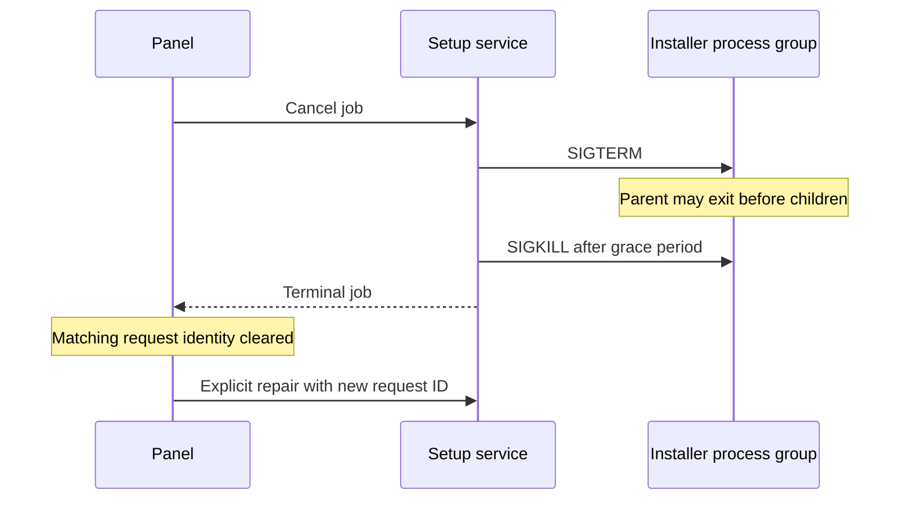

## Context

Current development rules prohibit unrequested compatibility. The installer still recognizes former product identifiers, while review reproduced two setup failures: cancellation resolves when the parent exits even if a child survives, and a recovered failed request can consume the next explicit repair action.

The ADR graph leaves 0001, 0002, 0003, 0005, 0006, and 0009 in force; 0004 → 0007 → 0008 → 0009 records supersession. ADR-0002 and ADR-0003 retain obsolete installer commitments and need a superseding decision. Distribution, ownership, setup entry points, and current member persistence remain unchanged.

## Goals / Non-Goals

**Goals:** one current installer contract, safe repeatable installation, completed cancellation before retry, and a fresh request identity after recovering a completed setup job.

**Non-Goals:** new APIs, automatic data conversion/reset, dependency changes, daemon restart, or new member execution behavior.

## Decisions

| Area | Decision | Reason / alternative rejected |
|------|----------|-------------------------------|
| Installer and inspection | Remove former markers, manifest deletion, hook matching, and environment aliases | Keeping dormant branches contradicts the development constraint |
| Current assets | Preserve marker validation, idempotency, user hook chaining, selected components, and partial repair | Full-file replacement would discard project content |
| Cancellation | Share one stop promise; terminate the process group after a bounded grace period and await it before settling | Clearing escalation on parent exit leaves surviving children free to write |
| Setup retry | Clear pending identity when the service exposes the matching job | Keeping it after recovery turns an explicit repair into a replay of the failure |
| Decisions | Supersede ADR-0002 and ADR-0003 together, carrying forward unchanged workflow and installation rules | Editing accepted records would erase their historical rationale |

## Risks / Trade-offs

- Former identifiers stop receiving special handling → intentional development contract; do not convert or delete unrelated files.
- Cancellation waits an additional bounded 500 ms → prevents overlapping writes and allows normal termination first.
- Fixture UI checks do not exercise provider execution → member execution is unchanged; verify actual installed panel bundle and setup RPC recovery with fixtures.

## Migration Plan

No data migration. Regenerate bundled workflow assets, typecheck and test, reload only the plugin, synchronize current specs, and archive. No automatic commit or push. A code rollback would require rebuilding the bundle and reloading the plugin.

## Open Questions

ADR-0010 will supersede ADR-0002 and ADR-0003 to remove their compatibility commitments while retaining the engineering workflow and installation safeguards. No unresolved product choices remain.
