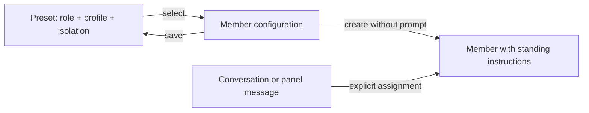

## Context

Users define ongoing roles and reuse their configuration. The current composer instead requires a separate one-time task and the runtime immediately sends it. Paseo's create API accepts an optional prompt, so a configured member can be created without starting a turn.

Reviewed ADR-0001 through ADR-0007: ADR-0007 supersedes ADR-0004; ADR-0001, 0002, 0003, 0005, 0006, and 0007 are in force. This change retains distribution, workflow, installation, ownership, local persistence, and recovery rules while replacing ADR-0007's mandatory initial-task decision.

## Goals / Non-Goals

**Goals:** one role-responsibility model, reusable project Presets, members waiting for explicit assignments, historical state readability.

**Non-Goals:** editing live role instructions, scheduling work, global presets, changing provider permissions, automatically creating a team.

## Decisions

1. Remove Task from the composer and start contract. Reject unknown start fields, including stale clients' task input, rather than silently discard a requested assignment. Keep internal RPC naming stable. Built-ins supply their guidance; Custom has a required name and optional single Responsibilities field.
2. Omit `prompt` from Paseo creation. Role guidance and shared rules remain in `systemPrompt`, including waiting for an assignment. Reconcile actual host status through the existing refresh path. Do not fabricate a kickoff prompt or treat responsibilities as an initial message.
3. Keep the version 1 state format and make stored `task` optional solely for reading historical records. New members omit it. Cards summarize role responsibilities; older tasks appear in details as Historical initial task. Neither recovery nor refresh replays them.
4. Keep template storage and RPC contracts unchanged. Display Preset throughout the UI. Selecting populates the configuration; saving does not create an agent; creation snapshots the configuration. Built-in duties remain fixed.
5. Use a neutral Message action on cards so first assignments and later follow-ups use the same existing owned-member endpoint. Idle cards direct users to send work; errors and actual statuses remain visible.

## Risks / Trade-offs

- [Stale clients submit Task] → Strict validation fails visibly; reload brings the current form. Silently accepting old input would lose work.
- [Older plugin requires stored task] → Forward reading is supported; rolling back requires preserving current state and using a compatible reader. No destructive migration.
- [Custom duties are omitted] → The name and shared rules remain; work is assigned explicitly later. Do not require invented responsibilities.
- [Creation is mistaken for execution] → Use Create member, no initial prompt, and conversation guidance. Provider initialization may still occur.

## Migration Plan

Deploy shared, server, and client changes together after typechecking; reload the installed plugin. Existing presets and members require no data rewrite. Verify no-prompt runtime calls, idempotent retries, historical task readability, preset CRUD, and compact/theme layouts.

## Open Questions

ADR-0007's mandatory initial task is superseded by ADR-0008. The user has resolved the product choice: members hold ongoing roles and receive work later. No remaining product questions.
